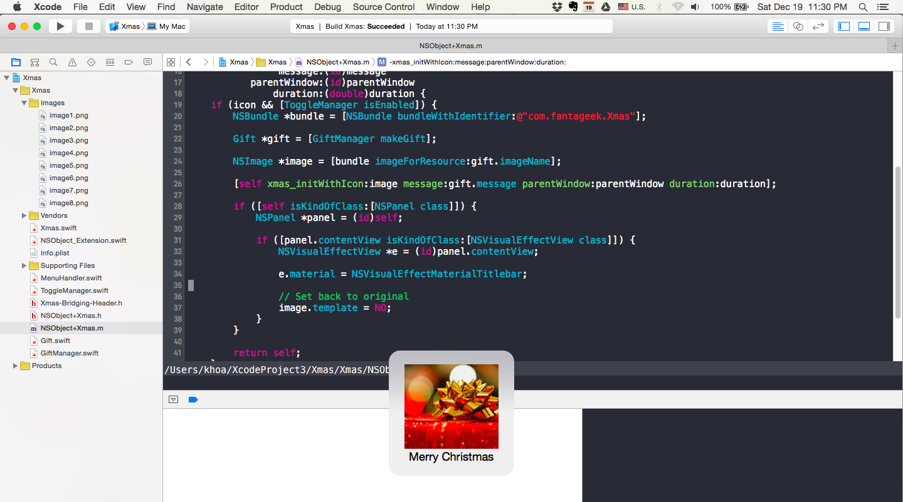

# Xmas
It's beginning to look a lot like Christmas

# Features
- Every time a build succeeds, Xmas comes
- Toggle via `Edit -> Xmas`

## Credit
- Credit goes to [How To Create an Xcode Plugin: Part 1/3](http://www.raywenderlich.com/94020/creating-an-xcode-plugin-part-1)

## Author

Khoa Pham, onmyway133@gmail.com

## License

Xmas is available under the MIT license. See the LICENSE file for more info.
